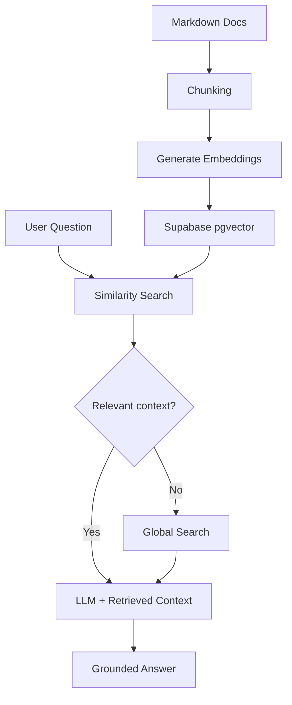

Retrieval-Augmented Generation (RAG) has become the default pattern for domain-specific chat systems.

Instead of fine-tuning a model on your data, you retrieve relevant documents at query time and let the LLM answer from that context.

It sounds simple. In practice, the gap between a working demo and a useful assistant is mostly about **knowledge quality, retrieval accuracy, and UX expectations**.

## Why RAG instead of a plain chatbot

For most product teams, RAG is the right starting point because:

- Answers stay grounded in your own documentation
- You can update knowledge without retraining a model
- It is cheaper and faster to ship than custom fine-tuning
- You control what the model is allowed to see

The trade-off: your chat quality is only as good as your retrieval pipeline and source material.

## Case study: DIFINES AI

While working on the [DIFINES AI](https://difines-ai.vercel.app/) consultant, the goal was straightforward — help users understand the DIFINES ecosystem without reading through long docs manually.

The stack:

- **Knowledge source:** Markdown documentation
- **Embeddings:** Gemini embedding-001
- **Vector store:** Supabase pgvector in PostgreSQL
- **Retrieval:** Similarity search over chunked documents
- **Fallback:** Global search when no relevant knowledge base results are found
- **Generation:** Groq Llama 3.3 70B via AI SDK
- **Frontend:** React chat UI aligned with the existing DIFINES landing page

The ingestion flow was: chunk markdown files → generate embeddings → store in pgvector → retrieve top matches on each user question → pass context to the LLM.

When vector search returns no useful match, the system falls back to global search so users can still get an answer instead of hitting a dead end.

This worked well for a focused domain assistant where answers should come from verified project documentation first — with a broader fallback when the knowledge base does not cover the question.

## What worked well

**Markdown as the knowledge base**

Simple to maintain, version in Git, and easy for non-engineers to update.

**pgvector inside Supabase**

One database for application data and vector search means less infrastructure to manage early on.

**Fast inference with Groq**

Low-latency responses matter in chat UX. Users expect near-instant replies, not long waits.

**Scoped domain**

RAG performs best when the assistant has a clear boundary rather than trying to answer everything.

**Grounded answers**

When retrieval works, responses stay tied to actual documentation instead of relying on generic model knowledge.

**Global search fallback**

Pure RAG breaks down when the knowledge base has no useful match. A fallback path improves coverage without forcing the model to guess from weak context.

**Testing with real user questions**

Real questions surfaced retrieval gaps and edge-case phrasing much earlier than curated demo prompts.

## What was hard

**Retrieval quality is the real product**

Bad chunking or weak embeddings can give the model irrelevant context while the final answer still sounds confident.

**Stale knowledge**

If documentation changes but embeddings are not regenerated, the assistant can quietly become outdated.

**Chunk size trade-offs**

Too small loses context. Too large creates noisy retrieval and increases token usage.

**No retrieval means weak answers**

A strict RAG-only system can fail when nothing relevant exists in the knowledge base. This is where fallback design becomes important.

**Evaluation still takes iteration**

Similarity scores alone do not tell you whether an answer is actually useful. Retrieved chunks and final responses still need real evaluation.

## What I would prioritize next time

- Show whether an answer came from internal docs or global search
- Re-ingest automatically when documentation changes
- Log retrieved chunks and fallback triggers per query
- Keep expanding evaluation cases from real user questions
- Keep the assistant scope narrow and explicit

## Final thoughts

RAG chat systems are not really about choosing the best LLM.

They are about **document structure, retrieval design, and honest UX**.

DIFINES AI showed that a lightweight stack — Markdown, pgvector, fallback search, and fast inference — can deliver real value when the domain is clear and the knowledge base is maintained.

If you are building a RAG chatbot today, spend less time obsessing over model selection and more time on chunking, ingestion, retrieval quality, fallback behavior, and testing with real users.
